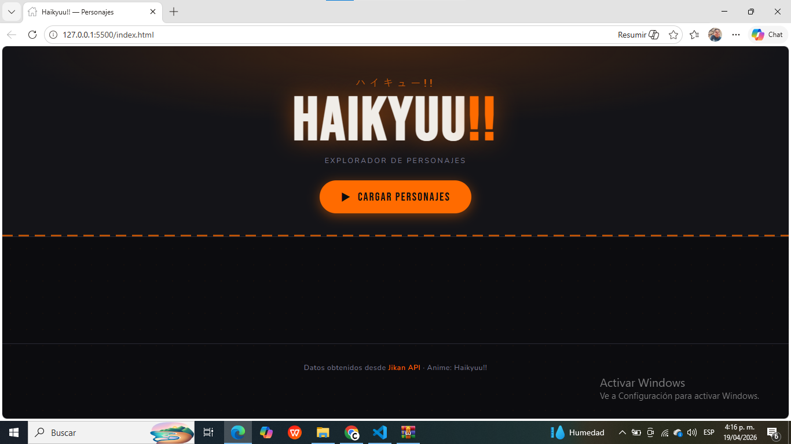

# Explorador de Personajes — Haikyuu!!

Aplicación web desarrollada en HTML, CSS y JavaScript que consume la API pública de Jikan para obtener y visualizar personajes del anime *Haikyuu!!*.

El sistema permite consultar dinámicamente información de personajes y renderizarla en una interfaz tipo grid mediante manipulación del DOM.

---

## Descripción general

El proyecto implementa un flujo de consumo de API en dos etapas:

1. **Búsqueda del anime** mediante query (`haikyuu`) para obtener su identificador (`mal_id`)
2. **Consulta de personajes** usando el ID obtenido

Los datos son procesados y representados dinámicamente en tarjetas visuales.

---

## Tecnologías utilizadas

* HTML5
* CSS3
* JavaScript
* Fetch API

---

## API utilizada

* **Jikan API**: https://jikan.moe

### Endpoints utilizados:

* Búsqueda de anime:

```
GET https://api.jikan.moe/v4/anime?q=haikyuu&limit=1
```

* Obtención de personajes:

```
GET https://api.jikan.moe/v4/anime/{id}/characters
```

---

## Flujo de ejecución

1. El usuario presiona el botón **"Cargar Personajes"**
2. Se deshabilita el botón para evitar múltiples solicitudes
3. Se realiza una petición para obtener el `mal_id` del anime
4. Con el ID, se consulta la lista de personajes
5. Se limita la respuesta a 30 elementos
6. Se generan dinámicamente tarjetas (`article`) en el DOM
7. Se actualiza el contador de resultados
8. Se manejan errores en caso de fallo en la petición

---

## Estructura del proyecto

```id="q8sn12"
/proyecto
│── index.html
│── styles.css
│── script.js
│── README.md
│── /images
│     └── evidencias
```

---

## Funcionalidades implementadas

* Consumo de API REST con `fetch`
* Manejo de asincronía con `async/await`
* Validación de respuestas HTTP
* Renderizado dinámico de componentes
* Manejo de errores en interfaz (no consola)
* Lazy loading de imágenes
* Diferenciación visual entre personajes principales y secundarios

---

## Manejo de errores

El sistema contempla los siguientes casos:

* Fallo en la conexión con la API
* Respuesta vacía
* Error en el endpoint

Los errores se muestran directamente en la interfaz mediante un contenedor dinámico .

---

##  Evidencias

A continuación se incluyen capturas del funcionamiento del sistema:

###  Carga inicial




###  Renderizado de personajes


---


##  Autor

Desarrollado por Herrera camilo y Berti Luis como práctica académica para el consumo de APIs

---
